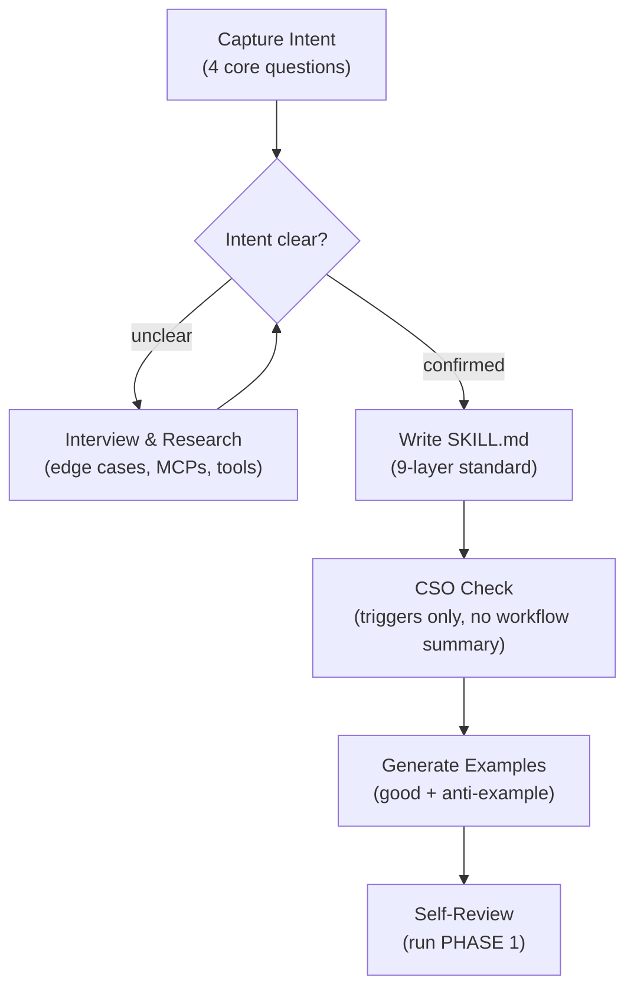
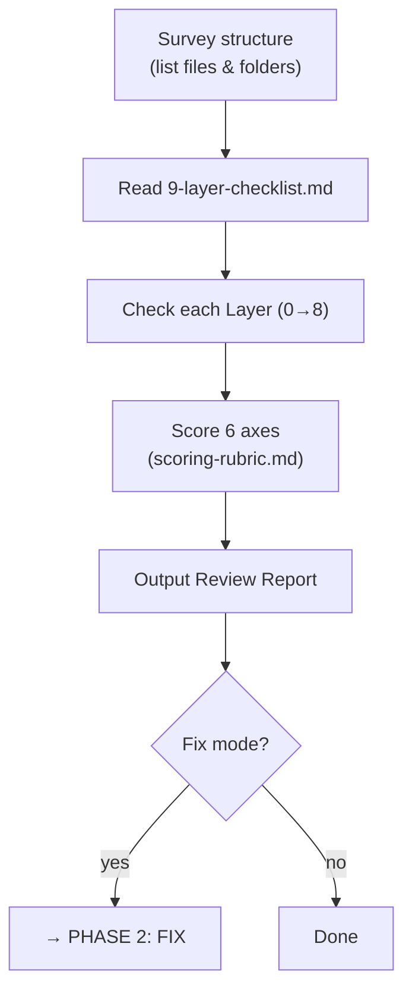
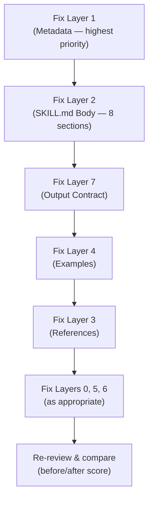

# SKILL: Skill Master — Create, Review & Fix Skills to the 9-Layer Standard

## 1. PURPOSE
This skill has 3 modes:
- **Create**: Capture intent → Interview → Write SKILL.md to the 9-layer standard → Generate examples → Self-review.
- **Review**: Evaluate a skill against the 9-Layer framework, score 6 axes, identify issues.
- **Fix**: Based on the review, automatically rewrite / fill in missing parts to bring the skill up to standard.

The user can choose any mode, or combine them (create → review, review → fix).

## 2. WHEN TO USE
✅ Use when:
- **Create**: Starting a skill from scratch — "write a skill for me", "I want to package this workflow as a skill"
- **Review**: Auditing / scoring / checking an existing skill
- **Fix**: Refactoring / standardizing an old skill to match the correct format
- Asking "is this skill up to standard?" and wanting to fix it right away
- Upgrading a skill from Failing / Basic to Good / Mature

❌ Do NOT use for:
- Reviewing a standalone prompt that is not a skill
- Reviewing code unrelated to skill structure

## 3. EXPECTED INPUTS
**Create mode:**
- A description of the skill idea (required) — can be brief; will interview for more
- Skill type: technique / pattern / reference (optional)

**Review / Fix mode:**
- Path to skill directory OR contents of SKILL.md (required)
- Mode: `review` | `fix` | `review+fix` (optional, default: review+fix)
- Skill type: personal / team / enterprise (optional, default: personal)

## 4. WORKFLOW

### PHASE 0 — CREATE (only runs when mode is `create`)



**Step 1: Capture Intent**
- If the conversation already contains a concrete workflow → extract it first, then confirm with user
- Ask 4 core questions (only ask what isn't already clear):
  1. What does this skill solve? For whom?
  2. When should it trigger / NOT trigger?
  3. What should the output look like?
  4. Skill type: **technique** (clear steps) / **pattern** (mental model) / **reference** (lookup docs)?

**Step 2: Interview & Research**
- Ask about edge cases, required vs optional inputs/outputs
- If MCPs or domain-specific tools are involved → research before writing
- Confirm with user before moving to Step 3

**Step 3: Write SKILL.md to the 9-Layer Standard**

*Layer 1 — Metadata:*
- Read `references/metadata-formula.md` to write description using the correct formula
- Description starts with `Use this skill when...`, lists positive + negative triggers
- **Do NOT summarize workflow in description** — only describe when to use (CSO rule)
- Be slightly "pushy": list more trigger scenarios than the minimum to avoid undertriggering
- name: letters, numbers, hyphens only

*Layer 2 — SKILL.md Body:*
- Write all 8 sections (PURPOSE → FINAL CHECK) per the standard
- SKILL.md < 500 lines; knowledge blocks > 30 lines → move to references/
- Use imperative form for instructions ("Read...", "Check...", "Output...")
- Explain WHY behind important rules instead of just using MUST/NEVER
- **Add a Mermaid `flowchart TD` diagram in the WORKFLOW section** showing the skill's process flow — place it right after the section heading, before the step-by-step instructions. Model it after `brainstorming` and `writing-plans` skills.

*Layer 7 — Output Contract:*
- Clearly define output structure, PASS criteria, and a FINAL CHECK of 5–7 items

**Step 4: CSO Check (Claude Search Optimization)**
- Verify description contains only triggering conditions, no workflow summary
- Keyword coverage: specific errors, symptoms, tool/command names
- Token efficiency: prefer inline for content < 50 lines, separate file for > 100 lines

**Step 5: Generate Examples**
- Create `examples/` directory with at least:
  - 1 good example: clear input → process → output
  - 1 anti-example: bad pattern + analysis of why it's wrong
- One great example beats many mediocre ones

**Step 6: Quick Self-Review**
- Run PHASE 1 (Review) on the newly created skill
- Score 6 axes, list any gaps
- Output a short report for the user

---

### PHASE 1 — REVIEW (always runs before FIX)



**Step 1: Survey the structure**
- Read the full skill directory (view directory tree)
- List all files and folders
- Compare against the standard structure:
  ```
  skill-name/
  ├── SKILL.md          (required)
  ├── references/       (recommended)
  ├── examples/         (recommended)
  ├── scripts/          (optional)
  └── assets/           (optional)
  ```

**Step 2: Read `references/9-layer-checklist.md`** — understand the detailed criteria

**Step 3: Check each Layer (0→8)**

| Layer | Name | What to check |
|-------|------|---------------|
| 0 | Use Case & Trigger Map | What the skill solves, for whom, positive/negative triggers |
| 1 | Metadata | YAML frontmatter: name, description |
| 2 | SKILL.md Body | All 8 sections present? Under 500 lines? Clear workflow? Mermaid diagram in WORKFLOW section? |
| 3 | References | Directory exists? SKILL.md specifies when to read each file? |
| 4 | Examples | ≥1 good example + ≥1 anti-example? |
| 5 | Scripts | Automation scripts present if needed? |
| 6 | Assets | Templates separated from references? |
| 7 | Output Contract | Output format + pass criteria + self-check present? |

**Step 4: Score 6 axes** — read references/scoring-rubric.md

**Step 5: Output Review report** — per the Output Format below

---

### PHASE 2 — FIX (only runs when mode is `fix` or `review+fix`)



**Fix Principles:**
- PRESERVE the original domain content — only restructure and supplement
- Log changes after fixing each layer

**Step 6: Fix each layer in priority order**

Priority order (most critical first):

1. **Fix Layer 1 — Metadata**
   - If YAML frontmatter is missing → add it
   - If description is weak → rewrite using the formula:
     ```
     Use this skill when the user asks to '[trigger 1]',
     '[trigger 2]'... Do NOT use for: [negative trigger].
     ```
   - Keep the original name

2. **Fix Layer 2 — SKILL.md Body**
   - Identify where the original content belongs in the 8 sections
   - Restructure into the correct 8 sections:
     1. PURPOSE (2–3 sentences)
     2. WHEN TO USE (positive ✅ + negative ❌ triggers)
     3. EXPECTED INPUTS (required vs optional)
     4. WORKFLOW (specific steps, referencing resources)
     5. OUTPUT FORMAT (structure, length, template)
     6. RESOURCE USAGE (when to read which file)
     7. GUARDRAILS (restrictions, limits)
     8. FINAL CHECK (self-check checklist, 5–7 items)
   - **Add a Mermaid `flowchart TD` diagram in section 4 (WORKFLOW)** if missing — place it right after the section heading, before step-by-step instructions
   - If original content is too long → move knowledge sections to references/

3. **Fix Layer 7 — Output Contract**
   - Add OUTPUT FORMAT if missing
   - Add PASS / NEEDS WORK / FAILING criteria
   - Add FINAL CHECK checklist

4. **Fix Layer 4 — Examples**
   - Create examples/ directory if absent
   - Generate at least 1 good example from skill content
   - Generate at least 1 anti-example with error analysis
   - If original skill has scattered examples → consolidate in examples/

5. **Fix Layer 3 — References**
   - If SKILL.md has long knowledge blocks (>30 lines) → move to references/
   - Add Resource Usage section specifying when to read each file

6. **Fix Layers 0, 5, 6** — add as appropriate for the skill type

**Step 7: Output fixed skill**
- Present files to the user

**Step 8: Quick re-review on the fixed skill**
- Re-score 5 axes
- Compare before/after
- Output comparison table

## 5. OUTPUT FORMAT

### Section 0 — Create Result

```
# ✨ NEW SKILL: [skill name]

## Directory structure
[tree output]

## Files created
- SKILL.md: [brief description]
- examples/good-example.md
- examples/anti-example.md
- references/ (if any)

## Quick review after creation
- Score: X/25 — [level]
- Gaps to note: ...
```

### Section A — Review Report

```
# 📋 REVIEW REPORT: [skill name]

## Overview
- Name: ... | File count: ...
- Score: X/25 — [Failing | Basic | Good | Mature]

## Layer-by-layer assessment
| Layer | Name | Status | Notes |
|-------|------|--------|-------|
| 0 | Use Case | ✅/⚠️/❌ | ... |
| ... | ... | ... | ... |

## 5-axis score
| Axis | Score (1–5) | Notes |
|------|-------------|-------|

## Top 3–5 items to fix
1. [Action] — [Layer] — [Priority]
```

### Section B — Fix Report (only when fixes were made)

```
# 🔧 FIX REPORT: [skill name]

## Changelog
| # | Change | Layer | Details |
|---|--------|-------|---------|

## Before/after comparison
| Axis | Before | After | Δ |
|------|--------|-------|---|

## New directory structure
[tree output]
```

## 6. RESOURCE USAGE
- Always read before reviewing: `references/9-layer-checklist.md`
- Read when scoring: `references/scoring-rubric.md`
- Read when writing or fixing metadata: `references/metadata-formula.md`
- Reference for examples: `examples/`

## 7. GUARDRAILS

**When Creating:**
- Do NOT write SKILL.md before confirming intent with the user
- Description must describe only triggering conditions — do NOT summarize workflow (CSO rule)
- If the domain is complex or requires specific tooling → research before writing
- Skill < 500 lines; move long knowledge blocks to references/

**When Fixing:**
- Do NOT delete original domain content — only restructure and supplement
- Do NOT change the skill name unless the user requests it
- Prefer editing files in place; create a new copy only if the user wants to preserve the original

**General:**
- If domain is unclear → ask user before writing or fixing
- Personal skills: minimum Layer 1 + 2 + 4 + 7 is sufficient
- Tone: constructive, specific, action-oriented; explain WHY rather than just issuing commands

## 8. FINAL CHECK
☐ Create: Confirmed intent with user before writing?
☐ Create: Description starts with "Use this skill when..." and contains no workflow summary?
☐ Create: SKILL.md has all 8 sections and is < 500 lines?
☐ Create: Generated at least 1 good example + 1 anti-example?
☐ Create: Self-reviewed and scored 5 axes?
☐ Review: Checked all layers (0–7)?
☐ Review: Each layer has a clear status (✅/⚠️/❌)?
☐ Review: Scored 5 axes with notes?
☐ Review: Top 3–5 specific, prioritized recommendations?
☐ Fix: Preserved original domain content?
☐ Fix: Restructured SKILL.md into all 8 sections?
☐ Fix: Created examples if missing?
☐ Fix: Re-ran review and compared before/after?
