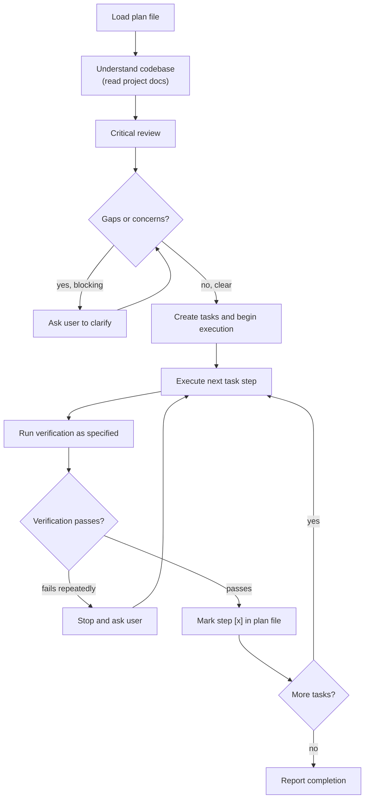

# Executing Plans

Execute implementation plans step-by-step with critical review and verification at each stage.

**Announce at start:** "I'm using the executing-plans skill to implement this plan."

## Checklist

You MUST complete these steps in order:

1. **Load plan** — read the plan file provided as argument, or find the most recent in `docs/agent-docs/plans/`
2. **Understand codebase** — read project docs to understand rules, structure, conventions, and standards
3. **Critical review** — identify gaps, contradictions, or missing dependencies before writing any code
4. **Clarify blockers** — raise concerns with the user before starting; don't guess
5. **Execute tasks** — follow each step exactly, run all verifications as specified
6. **Report completion** — notify the user with a summary of what was implemented

## Process Flow

**The terminal state is the completion report.** After reporting, the execution process is done.

## The Process in Detail

**Loading the plan:**

- Load the plan file provided as argument. If no path given, search `docs/agent-docs/plans/` for the most recent plan.
- Plans are typically generated by the `writing-plans` skill.

**Understanding the codebase:**

Read these project docs (if they exist) before executing any tasks. This ensures implementation follows the project's actual rules and conventions — not assumptions.

**Technical docs:**

| File | What you learn |
|------|---------------|
| `./docs/development-rules.md` **(IMPORTANT)** | File naming conventions, file size management, development rules and best practices, code quality standards, security guidelines |
| `./docs/codebase-summary.md` | Project structure and current status, high-level architecture overview, component relationships |
| `./docs/code-standards.md` | Coding conventions and standards, language-specific patterns, naming conventions |
| `./docs/design-guidelines.md` | Design system guidelines, branding and UI/UX conventions, component library usage |

**Business/domain docs:**

| File | What you learn |
|------|---------------|
| `./docs/domain-context.md` | Business domain overview, problem space, stakeholders, key workflows and business rules |
| `./docs/domain-model.md` | Core entities, aggregates, value objects, relationships between domain concepts |
| `./docs/domain-glossary.md` | Ubiquitous language — canonical terms and definitions used across code and communication |

If a doc doesn't exist, skip it — don't ask the user about it.

**Critical review:**

Before writing any code, read the entire plan and ask:
- Are there missing dependencies or imports not defined in any task?
- Do types, method signatures, and property names stay consistent across tasks?
- Are any steps vague ("add appropriate error handling") without actual code?
- Are there references to files or functions that don't exist yet and aren't created in the plan?

If you find a blocking issue, raise it with the user. If the issue is minor and clearly resolvable, note it and proceed.

**Executing tasks:**

- Mark each task `in_progress` before starting, `completed` when done.
- Follow each step exactly — the plan is intentionally detailed (2-5 minutes per step).
- Run every verification command specified; don't skip them.
- If a step references another skill, invoke it.
- Don't fix adjacent problems you notice — stay focused on the current task. Note issues to raise at the end.
- **After each step passes verification, update the plan file immediately:** change `- [ ]` to `- [x]` for that step. This keeps the plan file as a live record of progress.

## When to Stop and Ask

**Stop immediately when:**
- A test fails and you don't understand why after one investigation pass
- A dependency is missing and not in the plan
- An instruction is ambiguous and could lead to two different implementations
- Verification fails repeatedly with no clear fix

**Ask for clarification rather than guessing.** A one-minute pause is better than 20 minutes of wrong implementation.

## Completion

After all tasks are done, notify the user:

> "Execution complete. Implemented: [brief bullet list of what was built]."

## Key Principles

- **Review before coding** — find problems in the plan before they become problems in the code
- **Follow steps exactly** — the plan was written to be followed, not improvised
- **Run every verification** — skipped checks hide bugs until production
- **Stop when blocked** — don't push through ambiguity by guessing
- **Stay on scope** — don't fix unrelated issues mid-execution

