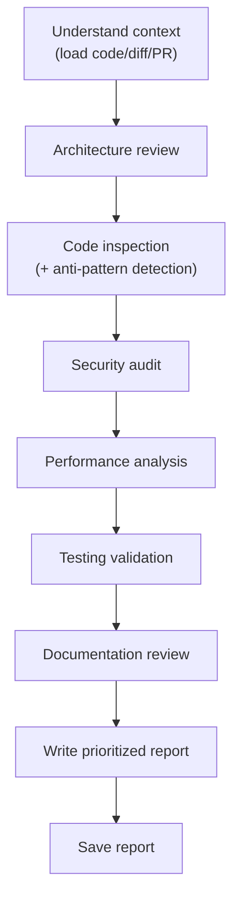

# Code Review

Review code thoroughly across quality, security, performance, and correctness dimensions, then produce a prioritized, actionable report.

**Announce at start:** "I'm using the code-review skill to review this code."

## Checklist

You MUST complete these steps in order:

1. **Understand context** — identify what is being reviewed (PR, file, diff, branch) and load the code
2. **Architecture review** — evaluate design, consistency with existing patterns, separation of concerns
3. **Code inspection** — check naming, function design, error handling, and anti-patterns
4. **Security audit** — check input validation, auth/authz, data protection, and dependencies
5. **Performance analysis** — evaluate algorithms, database queries, caching, and resource management
6. **Testing validation** — assess test coverage, quality, and edge case handling
7. **Documentation review** — check comments, docstrings, and updated docs
8. **Write report** — save to `docs/agent-docs/reviews/YYYY-MM-DD-<topic>-review.md`

## Process Flow



**The terminal state is the saved report.** After the report is written, notify the user and stop.

## The Process

**Understanding context:**

- If given a PR number: run `gh pr view <number> --json title,body,files` and `gh pr diff <number>` to load the full context.
- If given file paths: read each file in full with context from surrounding modules.
- If given a branch: run `git diff main...<branch>` to load all changes.
- Assess scope: number of files changed, type of change (feature/bugfix/refactor/config), whether tests are included.
- Read the PR description or commit message — understanding the intent is essential to a good review.

**Read project technical docs:**

Check `CLAUDE.md` for the `TECHNICAL_DOCS_DIRS` variable — it lists the directories containing architecture docs, coding standards, and conventions for this project. Read the relevant files in those directories before proceeding. This ensures the review judges code against the project's actual standards, not generic assumptions.

If `TECHNICAL_DOCS_DIRS` is not defined in `CLAUDE.md`, skip this step — don't ask the user about it.

**Architecture review:**

- Does the approach fit the existing patterns in the codebase?
- Is separation of concerns maintained? Are responsibilities clearly bounded?
- Are abstractions at the right level — not too generic, not too specific?
- Does the change introduce unnecessary coupling or circular dependencies?
- For existing codebases: explore the surrounding code to understand conventions before judging consistency.

**Code inspection:**

Inspect the code for quality issues across these categories:

*Naming and structure:*
- Variables and functions have descriptive, intention-revealing names
- Functions follow single responsibility principle and are under ~50 lines
- No dead code, commented-out blocks, or unused variables

*Error handling:*
- Errors are caught at appropriate boundaries, not swallowed silently
- Failure modes are explicit and recoverable

*Anti-patterns to flag:*

| Anti-Pattern | What to Look For |
|---|---|
| **God Class/Function** | One class/function handling many unrelated responsibilities |
| **Magic Numbers** | Hardcoded numeric or string values with no named constant |
| **Deep Nesting** | 3+ levels of nested conditions — suggest early returns |
| **Duplication** | Logic repeated across files that should be extracted |
| **Dead Code** | Unreachable branches, unused imports, obsolete feature flags |

**Security audit:**

- **Input validation:** Is user-controlled input validated and sanitized before use?
- **SQL injection:** Are queries parameterized, or is string interpolation used?
- **XSS:** Is user input rendered as HTML without escaping (e.g., `innerHTML` with user data)?
- **CSRF:** Are state-changing endpoints protected?
- **Hardcoded secrets:** API keys, tokens, or passwords in source code?
- **Auth/authz:** Are access controls present and applied at the right layer?
- **Dependencies:** Are new packages well-maintained and free of known vulnerabilities?

**Performance analysis:**

- Are algorithms appropriate for the expected data size (O(n²) in a hot path is a red flag)?
- Are database queries efficient? Are N+1 query patterns present?
- Is caching used appropriately, or are expensive operations repeated unnecessarily?
- Are file handles, connections, and other resources closed after use?
- Are there obvious memory leak patterns (unbounded lists, retained closures)?

**Testing validation:**

- Are unit tests present for the new/changed logic?
- Are integration or edge-case tests included where the behavior is non-obvious?
- Are tests readable — does the test name describe what behavior it verifies?
- Are tests deterministic (no reliance on time, random values, or external state without mocking)?
- Is test coverage proportional to the risk of the code being changed?

**Documentation review:**

- Does complex logic have an explanatory comment (not just restating what the code does)?
- Are public functions and classes documented (docstrings with Args/Returns/Raises)?
- Is any user-facing documentation (README, API docs, changelogs) updated if needed?

## Review Report Format

Every report MUST use this structure:

```markdown
# Code Review: [PR title / feature name]

**Date:** YYYY-MM-DD
**Reviewed by:** Claude (code-review skill)
**Scope:** [What was reviewed — PR #N / files / branch]
**Change type:** [Feature / Bugfix / Refactor / Config]

---

## Summary

[2-4 sentences: what does this change do, and what is the overall assessment?]

---

## Findings

### 🔴 Critical — Must Fix
> Security vulnerabilities, data loss risks, broken functionality

- [ ] [File:line] **[Issue title]** — [explanation + suggested fix]

### 🟡 Important — Should Fix
> Performance problems, poor error handling, significant maintainability issues

- [ ] [File:line] **[Issue title]** — [explanation + suggested fix]

### 🟢 Nice-to-Have — Consider
> Style, naming, minor improvements, refactoring suggestions

- [ ] [File:line] **[Issue title]** — [explanation + suggested fix]

---

## Anti-Patterns Detected

| Pattern | Location | Severity |
|---|---|---|
| [Pattern name] | [File:line] | 🔴/🟡/🟢 |

*(Leave this section out if none found)*

---

## What's Done Well

[Specific callouts for good patterns, clean code, or clever solutions. Genuine and specific — not filler.]

---

## Checklist

- [ ] Architecture fits existing patterns
- [ ] No security vulnerabilities
- [ ] Performance is acceptable
- [ ] Tests cover new/changed logic
- [ ] Documentation is updated

---

## Verdict

**Approve / Request Changes / Needs Discussion**

[One sentence explaining the verdict.]
```

## Key Principles

- **Intent first** — understand what the change is trying to do before judging how it does it
- **Specific and actionable** — every finding must include file, line, and a concrete suggestion
- **Prioritize ruthlessly** — not every issue deserves equal weight; focus on what actually matters
- **Acknowledge quality** — call out what is done well, not just what needs fixing
- **No style nitpicking as blockers** — 🟢 issues should never block a merge
- **One issue per finding** — don't bundle multiple problems under one bullet

## Completion

After saving the report, notify the user:

> "Review complete and saved to `docs/agent-docs/reviews/<filename>.md`. Found [N critical / N important / N nice-to-have] issues."
