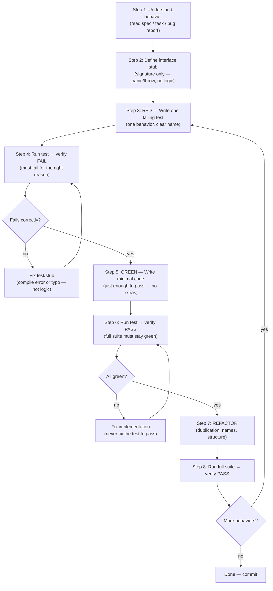

# Test-Driven Development (TDD)

## 1. PURPOSE

Guide the implementation of any feature or bugfix following the Red-Green-Refactor cycle: write a failing test first, write minimal code to pass it, refactor, then repeat. The Iron Law is absolute — no production code without a failing test witnessed first. This skill enforces that law and provides the complete workflow, language-specific patterns, and anti-pattern guidance to practice TDD correctly.

**Announce at start:** "Applying TDD: writing the failing test first, then implementing."

## 2. WHEN TO USE

✅ Use when:
- Implementing any new feature, function, method, or component
- Fixing a bug (write a test that reproduces the bug before touching implementation)
- Refactoring: add tests first if they don't exist, then refactor
- User says "TDD", "write tests first", "red-green-refactor", "viết test trước", "áp dụng TDD"
- User asks "how do I approach this feature test-first?"

❌ Do NOT use for:
- Reviewing existing tests without writing new production code
- Explaining what an existing test does (use regular chat)
- Adding tests to already-complete code without following the full TDD cycle — that is tests-after, not TDD
- Throwaway exploration spikes (throw the spike away when done, then restart with TDD)
- Configuration files, migrations, or generated code (ask the user first)

## 3. EXPECTED INPUTS

**Required:**
- Description of the feature, function, or bug to implement

**Optional:**
- Language / framework (`go`, `nextjs`, `typescript`, etc.)
- File paths for existing interfaces or types
- Acceptance criteria or specific edge cases to cover

## 4. WORKFLOW



**Step 1 — Understand the behavior:**
- Read the task, spec, or bug report in full
- Identify the simplest concrete behavior to implement first
- Do NOT start with the most complex scenario — build incrementally

**Step 2 — Define the interface stub:**
- Create the function/method/type signature only
- Body must be a no-op placeholder: Go → `panic("not implemented")`, JS/TS → `throw new Error("not implemented")`
- No logic yet — the stub exists only so the test compiles

**Step 3 — Write one failing test (RED):**
- Test name describes behavior, not method: `TestCreateUser_ReturnsIDOnSuccess`, not `TestCreateUser`
- One behavior per test — if the name contains "and", split it into two tests
- Use real code, not mocks, unless the dependency is truly external (network, DB, OS)
- Go: use table-driven tests for multiple scenarios of the same function
- Read `references/golang-testing-patterns.md` for Go-specific patterns
- Read `references/testing-anti-patterns.md` before adding any mock

**Step 4 — Verify RED (MANDATORY — never skip):**
- Run the test and confirm it **FAILS**
- Go: `go test ./... -run TestFunctionName -v`
- Next.js: `npm test -- --testPathPattern=path/to/test`
- The failure must say "feature missing / not implemented" — NOT a compile error, import error, or typo
- If the test passes immediately → you are testing existing behavior → fix or delete the test

**Step 5 — Write minimal implementation (GREEN):**
- Write the absolute simplest code that makes the test pass — nothing more
- YAGNI: do NOT add options, configuration, or generics the test does not require
- Do NOT refactor other code while in GREEN phase — one concern at a time

**Step 6 — Verify GREEN (MANDATORY):**
- Run the full test suite and confirm all tests pass — not just the new one
- If other tests broke: fix them now, before moving on

**Step 7 — Refactor:**
- Only after all tests are green: remove duplication, improve names, extract helpers
- No new behavior during refactor — only structural improvement
- Run the full suite after each refactor change to catch regressions immediately

**Step 8 — Repeat:**
- Return to Step 3 for the next behavior
- Systematically cover edge cases: empty / null inputs, error paths, boundary values, concurrent access

## 5. OUTPUT FORMAT

Label each phase clearly when presenting work:

```
## [RED] Test: <behavior being tested>
go / tsx
<test code>


## [Run] go test ./... -run TestXxx -v
Output:
--- FAIL: TestXxx
    expected X, got panic: not implemented
→ Confirmed: fails for the right reason. Proceeding to GREEN.

## [GREEN] Implementation: <function/type name>
go / ts
<implementation code>

## [Run] go test ./...
Output: PASS (N tests)
→ All green. Proceeding to REFACTOR.

## [REFACTOR] <what changed and why>
go / ts
<refactored code (only if changes made)>

## [Run] go test ./...
Output: PASS (N tests)
→ Refactor complete. [Next behavior: <X> | Done]
```

**Quality criteria:**

| Level | Criteria |
|---|---|
| ✅ PASS | Every test observed failing first; GREEN code is minimal; all tests pass after refactor; edge cases covered |
| ⚠️ NEEDS WORK | RED verification skipped on 1–2 tests; or GREEN code has YAGNI violations |
| ❌ FAILING | Implementation written before test; test never observed failing; tests-after masquerading as TDD |

## 6. RESOURCE USAGE

- **`references/testing-anti-patterns.md`**: Read when writing mocks, adding test utilities, or tempted to add test-only methods to production classes
- **`references/golang-testing-patterns.md`**: Read when writing Go tests — table-driven tests, httptest patterns, benchmark, fuzz
- **`examples/good-example-golang.md`**: Complete TDD session in Go (HTTP handler with table-driven tests)
- **`examples/good-example-nextjs.md`**: Complete TDD session in Next.js (API route + React component)
- **`examples/anti-example.md`**: Common TDD violations with analysis and recovery steps

## 7. GUARDRAILS

**The Iron Law:**
```
NO PRODUCTION CODE WITHOUT A FAILING TEST FIRST
```
Code written before the test → **delete it**. Starting over is not waste — keeping unverified code is technical debt. "Keeping it as reference" means you will adapt it. That is tests-after. Delete means delete.

**Common rationalizations — reject all of them:**

| Excuse | Reality |
|--------|---------|
| "Too simple to test" | Simple code breaks. Test takes 30 seconds. |
| "I'll test after" | Tests written after pass immediately — proves nothing. |
| "Already manually tested" | Manual is ad-hoc. No record, can't re-run, misses edge cases. |
| "Deleting X hours is wasteful" | Sunk cost. Unverified code is the real waste. |
| "TDD is dogmatic, I'm being pragmatic" | TDD IS pragmatic: finds bugs before commit, prevents regressions, documents behavior. |
| "Tests after achieve the same goals" | Tests-after answer "what does this do?" Tests-first answer "what should this do?" |
| "Need to explore first" | Fine — throw away the spike, then start over with TDD. |

**When stuck:**

| Problem | Solution |
|---------|----------|
| Don't know how to write the test | Write the API you wish existed. Write the assertion first. |
| Test too complicated to write | Design is too complicated. Simplify the interface. |
| Must mock everything | Code is too coupled. Use dependency injection. |
| Test setup is huge | Extract test helpers. Still complex? Simplify design. |
| Test passes immediately | You are testing existing behavior. Fix or delete the test. |

**Mocking rules:**
- Mock only truly external dependencies: network calls, filesystem I/O, databases (in unit tests)
- Never mock the system under test itself
- Never add test-only methods to production classes — put cleanup logic in test utilities
- Read `references/testing-anti-patterns.md` before adding any mock

## 8. FINAL CHECK

Before marking implementation complete:

☐ Every new function/method has a test that was observed failing before implementing?
☐ Each test failed for the expected reason (feature missing — not compile error or typo)?
☐ GREEN code is minimal — no YAGNI additions, no over-engineering?
☐ Full test suite passes (not just the new tests)?
☐ Edge cases covered: empty inputs, null/nil, error paths, boundary values?
☐ No test-only methods added to production types or classes?
☐ Mocks (if any) test real behavior, not mock behavior (see anti-patterns)?

Cannot check all boxes → TDD cycle was violated. Return to Step 3.
