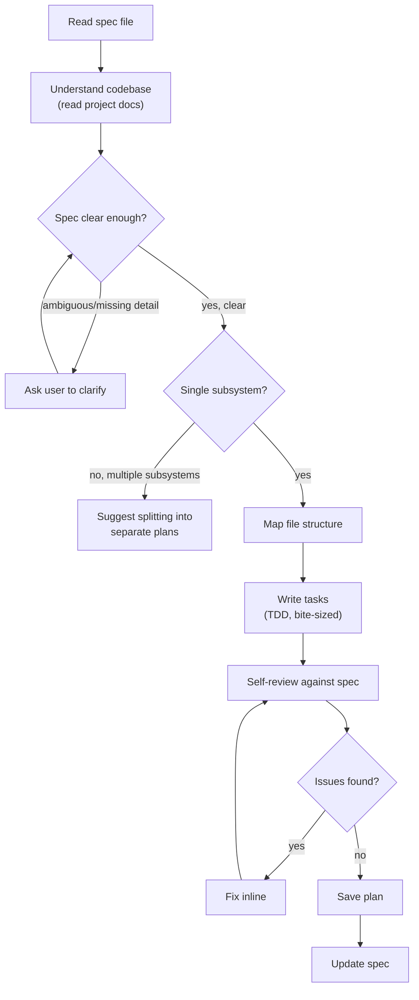

# Writing Plans

Write comprehensive implementation plans from a spec document. Assume the engineer has zero context for the codebase — document everything: which files to touch, code, testing, exact commands. DRY. YAGNI. TDD.

**Announce at start:** "I'm using the writing-plans skill to create the implementation plan."

## Checklist

You MUST complete these steps in order:

1. **Read spec file** — load the spec provided as argument, or find the most recent in `docs/agent-docs/specs/`
2. **Understand codebase** — read project docs to understand rules, structure, conventions, and standards
3. **Verify understanding** — identify ambiguous/contradictory requirements, ask user to clarify if needed
4. **Scope check** — ensure the spec is focused enough for a single plan
5. **Map file structure** — list all files to create/modify with responsibilities
6. **Write tasks** — break down into bite-sized TDD tasks with full code
7. **Self-review** — check spec coverage, placeholders, type consistency
8. **Save plan** — write to `docs/agent-docs/plans/YYYY-MM-DD-<feature-name>.md`
9. **Update spec** — mark this plan as `[x]` with file path in the spec's `## Implementation Plans` section

## Process Flow



**The terminal state is the saved plan + updated spec.** After saving and updating the spec, notify the user and stop.

## The Process

**Reading the spec:**

- Load the spec file provided as argument. If no path given, search `docs/agent-docs/specs/` for the most recent spec.
- This spec is typically generated by the `brainstorming` skill.

**Understanding the codebase:**

Read these project docs (if they exist) before writing any tasks. This ensures the plan follows the project's actual rules, structure, and conventions — not assumptions.

**Technical docs:**

| File | What you learn |
|------|---------------|
| `./docs/development-rules.md` **(IMPORTANT)** | File naming conventions, file size management, development rules and best practices, code quality standards, security guidelines |
| `./docs/codebase-summary.md` | Project structure and current status, high-level architecture overview, component relationships |
| `./docs/code-standards.md` | Coding conventions and standards, language-specific patterns, naming conventions |
| `./docs/design-guidelines.md` | Design system guidelines, branding and UI/UX conventions, component library usage |

**Business/domain docs:**

| File | What you learn |
|------|---------------|
| `./docs/domain-context.md` | Business domain overview, problem space, stakeholders, key workflows and business rules |
| `./docs/domain-model.md` | Core entities, aggregates, value objects, relationships between domain concepts |
| `./docs/domain-glossary.md` | Ubiquitous language — canonical terms and definitions used across code and communication |

- Apply what you learn from these docs when mapping file structure and writing task code.
- Follow the project's naming conventions, file organization, and coding patterns.
- If a doc doesn't exist, skip it — don't ask the user about it.

**Verifying understanding:**

- After reading the spec, identify any requirements that are ambiguous, contradictory, or missing critical detail.
- If found, ask the user to clarify before proceeding. Keep questions focused and minimal — only ask about issues that would lead to a wrong or incomplete plan.
- If the spec is clear, skip this step and proceed directly.

**Scope check:**

- If the spec covers multiple independent subsystems, it should have been broken into sub-project specs during brainstorming.
- If it wasn't, suggest breaking this into separate plans — one per subsystem. Each plan should produce working, testable software on its own.

**Mapping file structure:**

- Before defining tasks, map out which files will be created or modified and what each one is responsible for. This is where decomposition decisions get locked in.
- Design units with clear boundaries and well-defined interfaces. Each file should have one clear responsibility.
- Prefer smaller, focused files over large ones that do too much.
- Files that change together should live together. Split by responsibility, not by technical layer.
- In existing codebases, follow established patterns. If a file you're modifying has grown unwieldy, including a split in the plan is reasonable.

**Writing tasks:**

- Each step is one action (2-5 minutes): write the failing test → run it → implement minimal code → run test again.
- Every step must contain actual code, exact file paths, and exact commands with expected output.
- See **Task Structure** and **No Placeholders** sections below for format and rules.

**Self-review:**

- **Spec coverage:** Skim each section/requirement in the spec. Can you point to a task that implements it? List any gaps.
- **Placeholder scan:** Search the plan for red flags — "TBD", "TODO", vague steps, missing code blocks. Fix them.
- **Type consistency:** Do the types, method signatures, and property names in later tasks match what was defined in earlier tasks?
- If you find issues, fix them inline. If you find a spec requirement with no task, add the task.

## Plan Document Header

**Every plan MUST start with this header:**

```markdown
# [Feature Name] Implementation Plan

> Steps use checkbox (`- [ ]`) syntax for tracking progress.

**Goal:** [One sentence describing what this builds]

**Architecture:** [2-3 sentences about approach]

**Tech Stack:** [Key technologies/libraries]

---
```

## Task Structure

````markdown
### Task N: [Component Name]

**Files:**
- Create: `exact/path/to/file.go`
- Modify: `exact/path/to/existing.go:123-145`
- Test: `exact/path/to/file_test.go`

- [ ] **Step 1: Write the failing test**

```go
func TestSpecificBehavior(t *testing.T) {
    result := Function(input)
    if result != expected {
        t.Errorf("Function(%v) = %v, want %v", input, result, expected)
    }
}
```

- [ ] **Step 2: Run test to verify it fails**

Run: `go test ./path/to/package/ -run TestSpecificBehavior -v`
Expected: FAIL with "undefined: Function"

- [ ] **Step 3: Write minimal implementation**

```go
func Function(input InputType) OutputType {
    return expected
}
```

- [ ] **Step 4: Run test to verify it passes**

Run: `go test ./path/to/package/ -run TestSpecificBehavior -v`
Expected: PASS
````

## No Placeholders

Every step must contain the actual content an engineer needs. These are **plan failures** — never write them:
- "TBD", "TODO", "implement later", "fill in details"
- "Add appropriate error handling" / "add validation" / "handle edge cases"
- "Write tests for the above" (without actual test code)
- "Similar to Task N" (repeat the code — the engineer may be reading tasks out of order)
- Steps that describe what to do without showing how (code blocks required for code steps)
- References to types, functions, or methods not defined in any task

## Key Principles

- **Exact file paths always** — no ambiguity about where code lives
- **Complete code in every step** — if a step changes code, show the code
- **Exact commands with expected output** — engineer should know what success looks like
- **DRY, YAGNI, TDD** — no unnecessary features, no repeated logic, tests first

## Updating the Spec

After saving the plan, update the spec file to track progress across all plans.

**Locate or create the `## Implementation Plans` section** at the bottom of the spec file. If it doesn't exist, add it.

**Format:**

```markdown
## Implementation Plans

- [x] **Plan 1: <Title>** — <one-line summary>
  - `docs/agent-docs/plans/YYYY-MM-DD-<feature-name>.md`
- [ ] **Plan 2: <Title>** — <one-line summary>
- [ ] **Plan 3: <Title>** — <one-line summary>
```

**Rules:**
- Mark the just-saved plan as `[x]` and include its file path on the next line (indented with 2 spaces).
- Plans not yet created stay as `[ ]` with no file path.
- If the section already exists, update the matching entry in-place — do not duplicate.
- If this is the first plan from a multi-plan spec, list all planned plans as `[ ]` first, then mark this one `[x]`.

## Completion

After saving the plan and updating the spec, notify the user:

> "Plan complete and saved to `docs/agent-docs/plans/<filename>.md`. Spec updated."
